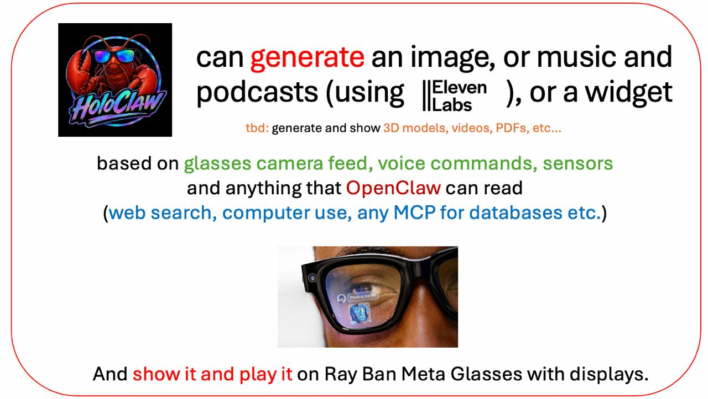
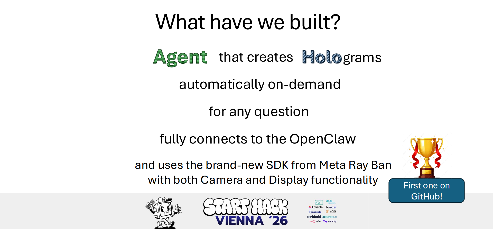
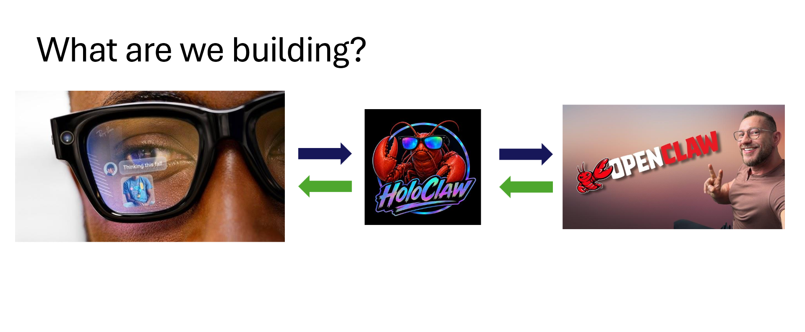
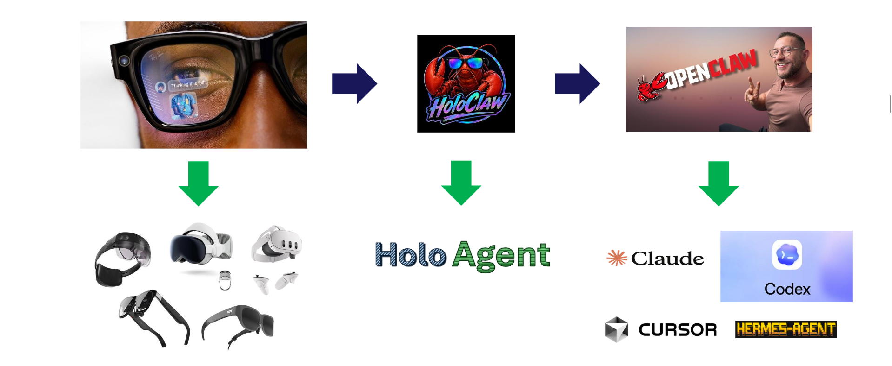
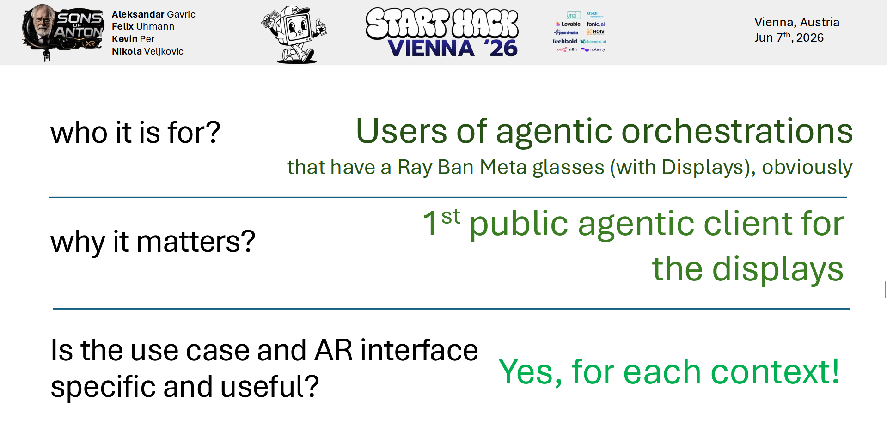

<p align="center">
  
</p>

# HoloClaw

A real-time AI assistant for Meta Ray-Ban smart glasses. See what you see, hear what you say, generate images and holographic widgets in your field of view, and take actions on your behalf — all through voice.

Built on the [Meta Wearables DAT SDK](https://wearables.developer.meta.com/) (iOS & Android) + [Gemini Live API](https://ai.google.dev/gemini-api/docs/live) + [OpenClaw](https://github.com/openclaw/openclaw) (optional).

**Supported platforms:** iOS (iPhone) and Android (Pixel, Samsung, etc.)

> This repository extends the open-source [Intent-Lab/HoloClaw](https://github.com/Intent-Lab/HoloClaw) sample apps with on-demand widgets and image generation, glasses-side rendering, and Android/iOS parity updates.

---

## Overview

HoloClaw turns Meta Ray-Ban smart glasses (or your phone camera) into a always-on voice + vision AI assistant:

| Capability | Description |
|------------|-------------|
| **Voice + vision** | Gemini Live sees through the camera (~1 fps) and talks back in real time |
| **Agentic actions** | Optional OpenClaw gateway lets Gemini send messages, search the web, manage lists, and more |
| **Widgets + images** | Ask for text notes, tables, maps, galleries, or calendars as live widget cards — or generate new images from what you see and say, shown on your phone and Ray-Ban Display lenses |
| **Audio generation** | OpenClaw + ElevenLabs can create music and podcasts from the same context, played through the glasses speakers |
| **Phone mode** | Test the full pipeline without glasses using your phone camera |

### What we built

<p align="center">
  
</p>

**HoloClaw** is an agent that answers in context by putting information in your field of view — **holographic widgets** (text, tables, maps, photos, calendars) and **generated images** created on demand from what you see and ask. It connects to **OpenClaw** for real-world actions and media generation, and is built on the Meta Ray-Ban **Device Access Toolkit** — using both **camera** (what you see) and **display** (what is shown on the lenses). The sample apps in this repo are the first public agentic client for Ray-Ban Display glasses on GitHub.

### Communication workflow

<p align="center">
  
</p>

At a high level, the loop is simple and bidirectional:

1. **Glasses (or phone)** — capture what you see and hear; show widgets, generated images, and responses in the display.
2. **HoloClaw app** — streams audio and video to the AI, renders widget cards and images on the phone and on the glasses display, and routes tool calls.
3. **OpenClaw** — optional backend that executes agentic tasks (messages, search, lists, image generation, and more) and returns results to be spoken or shown.

Data flows out from the wearable through the app to OpenClaw; answers, widgets, and generated visuals flow back through voice and the in-lens display.

### ElevenLabs

HoloClaw does not only **show** structured widget cards — it can **generate** new content from your context. Through **OpenClaw**, the assistant can create **images** from the camera feed, your voice, and tool results (web search, computer use, MCP databases, and more), then push them to the Ray-Ban display alongside widgets.

For audio, **[ElevenLabs](https://elevenlabs.io/)** adds **music** and **podcast** generation on the same inputs. Visuals land on the lenses; audio plays through the glasses speakers — so an answer can be a widget, a generated image, spoken text, or all of the above.

### Where we want to go

<p align="center">
  
</p>

**Vision hardware** — today we target Meta Ray-Ban (camera + display). We want to extend the same agentic experience — widgets, generated images, and audio — to more XR devices: slim AR glasses, mixed-reality headsets, and other always-on wearables that can see and show information in context.

**Agent orchestration** — the current stack uses **Gemini Live** on the phone plus **OpenClaw** for actions. Longer term we plan a dedicated **Holo Agent** layer and tighter integration with orchestration tools such as **Claude**, **Codex**, **Cursor**, and **Hermes-Agent**, so the right model or agent can handle each task while the glasses stay the consistent interface.

<p align="center">
  
</p>

### Sample apps in this repo

| Platform | Path | IDE |
|----------|------|-----|
| **iOS** | [`samples/CameraAccess/`](samples/CameraAccess/) | Xcode |
| **Android** | [`samples/CameraAccessAndroid/`](samples/CameraAccessAndroid/) | Android Studio |

---

## Run on iOS (Xcode)

### Prerequisites

- **macOS** with **Xcode 15.0+**
- **iPhone** running **iOS 17.0+** (physical device recommended; Simulator has limited camera/audio)
- **[Gemini API key](https://aistudio.google.com/apikey)** (free tier available)
- **Meta Ray-Ban glasses** (optional — use iPhone mode to test without hardware)
- **OpenClaw** on a Mac on the same Wi‑Fi (optional — for agentic actions)

### 1. Clone the repository

```bash
git clone https://github.com/Intent-Lab/HoloClaw.git
cd HoloClaw
```

If you are using this fork, clone your fork URL instead and `cd` into it.

### 2. Open the iOS project in Xcode

```bash
open samples/CameraAccess/CameraAccess.xcodeproj
```

In Xcode, wait for Swift Package Manager to resolve dependencies (Meta DAT SDK, etc.).

### 3. Configure API keys and secrets

Copy the example secrets file:

```bash
cp samples/CameraAccess/CameraAccess/Secrets.swift.example \
   samples/CameraAccess/CameraAccess/Secrets.swift
```

Edit `Secrets.swift` and set at minimum:

```swift
static let geminiAPIKey = "your-gemini-api-key"
```

Optional: OpenClaw host/port/tokens and WebRTC signaling URL (see [OpenClaw setup](#setup-openclaw-optional) below).

> `Secrets.swift` is gitignored. You can also enter the Gemini key later in the in-app **Settings** screen.

### 4. Select your iPhone and build

1. Connect your iPhone via USB (or use wireless debugging in Xcode).
2. In the Xcode toolbar, choose your **iPhone** as the run destination (not a Simulator if you want camera/glasses features).
3. If prompted, trust the developer certificate on the phone: **Settings → General → VPN & Device Management**.
4. Press **Run** (⌘R).

Grant **Microphone**, **Camera**, and **Bluetooth** permissions when the app asks.

### 5. Try the app

#### Without glasses (iPhone mode)

1. Launch **HoloClaw** / **HoloClaw** on your iPhone.
2. Tap **Start on iPhone** — uses the rear camera.
3. Tap the **AI** button to start a Gemini Live session.
4. Talk naturally; the assistant can see through your camera.

#### With Meta Ray-Ban glasses

Enable **Developer Mode** in the Meta AI app first:

1. Open the **Meta AI** app on your iPhone.
2. Go to **Settings** (gear icon).
3. Tap **App Info**.
4. Tap the **App version** number **5 times** to unlock Developer Mode.
5. Go back to Settings and turn **Developer Mode** **on**.

Then in HoloClaw:

1. Tap **Connect my glasses** and complete registration in the Meta AI app if needed.
2. Tap **Start streaming**.
3. Tap **AI** for voice + vision.
4. (Display glasses) Try **Hello World on Display** on the pre-stream screen, or ask Gemini to show widgets and generate images while streaming.

---

## Run on Android (Android Studio)

### Prerequisites

- **Android Studio** Ladybug (2024.2) or newer
- **JDK 17+** (bundled with Android Studio)
- **Android phone** running **Android 12+** (API 31+; target SDK 34)
- **GitHub Personal Access Token** with `read:packages` scope (required to download the Meta DAT Android SDK from GitHub Packages)
- **[Gemini API key](https://aistudio.google.com/apikey)**
- **Meta Ray-Ban glasses** (optional — use Phone mode without hardware)
- **OpenClaw** on a Mac on the same Wi‑Fi (optional)

### 1. Clone the repository

```bash
git clone https://github.com/Intent-Lab/HoloClaw.git
cd HoloClaw
```

### 2. Open the Android project in Android Studio

1. Launch **Android Studio**.
2. **File → Open** and select the folder:

   ```
   samples/CameraAccessAndroid/
   ```

3. Wait for **Gradle sync** to finish. The first sync downloads dependencies and may take several minutes.

### 3. Configure GitHub Packages (DAT SDK)

The Meta DAT Android SDK is hosted on GitHub Packages and requires authentication.

1. Create a **classic** token at [github.com/settings/tokens](https://github.com/settings/tokens) with the **`read:packages`** scope.
2. Create or edit `samples/CameraAccessAndroid/local.properties`:

   ```properties
   github_token=YOUR_GITHUB_TOKEN
   ```

   Alternatively, set the environment variable `GITHUB_TOKEN` before opening Android Studio.

> **Tip:** With the GitHub CLI: `gh auth token` (refresh with `gh auth refresh -s read:packages` if needed).
>
> A **401 Unauthorized** during Gradle sync almost always means the token is missing or lacks `read:packages`.

### 4. Configure API keys and secrets

```bash
cd samples/CameraAccessAndroid/app/src/main/java/com/meta/wearable/dat/externalsampleapps/cameraaccess/
cp Secrets.kt.example Secrets.kt
```

Edit `Secrets.kt`:

```kotlin
const val geminiAPIKey = "YOUR_GEMINI_API_KEY"
```

Optional: OpenClaw and WebRTC settings (see below). Values can also be changed in the in-app **Settings** screen.

### 5. Select your phone and build

1. On the phone: enable **Developer options** and **USB debugging** (or **Wireless debugging**).
2. Connect via USB or pair wirelessly (`adb pair <ip>:<port>`).
3. In Android Studio, select your device in the run-target dropdown.
4. Click **Run** (▶) or press **Shift+F10**.

Accept **Bluetooth**, **Microphone**, **Camera**, and **Internet** permissions when prompted.

### 6. Try the app

#### Without glasses (Phone mode)

1. Open **HoloClaw** on your Android phone.
2. Tap **Start on Phone** (from the home or device screen).
3. Tap the **AI** button to start Gemini Live.
4. Talk to the assistant — it uses your phone camera.

#### With Meta Ray-Ban glasses

Enable **Developer Mode** in the Meta AI app (same steps as [iOS above](#with-meta-ray-ban-glasses)), then:

1. Tap **Connect my glasses** and finish registration.
2. Tap **Start streaming**.
3. Tap **AI** for voice + vision.
4. (Display glasses) Use **Hello World on Display** or ask Gemini to render widgets and generate images while streaming.

> **Debug without hardware:** In debug builds, open the **bug icon** (Mock Device Kit) to pair a simulated Ray-Ban device.

---

## Setup: OpenClaw (optional)

OpenClaw gives Gemini the ability to take real-world actions and generate images, music, and podcasts. Without it, the app is voice + vision with on-device widget rendering (`action="render"` for text, tables, and image cards).

### 1. Install and configure OpenClaw

Follow the [OpenClaw setup guide](https://github.com/openclaw/openclaw). Enable the gateway in `~/.openclaw/openclaw.json`:

```json
{
  "gateway": {
    "port": 18789,
    "bind": "lan",
    "auth": {
      "mode": "token",
      "token": "your-gateway-token-here"
    },
    "http": {
      "endpoints": {
        "chatCompletions": { "enabled": true }
      }
    }
  }
}
```

### 2. Point the app at your gateway

**iOS** — `Secrets.swift`:

```swift
static let openClawHost = "http://Your-Mac.local"
static let openClawPort = 18789
static let openClawGatewayToken = "your-gateway-token-here"
```

**Android** — `Secrets.kt`:

```kotlin
const val openClawHost = "http://Your-Mac.local"
const val openClawPort = 18789
const val openClawGatewayToken = "your-gateway-token-here"
```

Find your Mac hostname: **System Settings → General → Sharing** (e.g. `Johns-MacBook-Pro.local`).

### 3. Start the gateway

```bash
openclaw gateway restart
curl http://localhost:18789/health
```

Phone and Mac must be on the **same Wi‑Fi** network.

---

## Requirements summary

| | iOS | Android |
|---|-----|---------|
| OS | iOS 17.0+ | Android 12+ (API 31+) |
| IDE | Xcode 15.0+ | Android Studio Ladybug+ |
| API key | Gemini (required) | Gemini (required) |
| Extra | — | GitHub `read:packages` token |
| Glasses | Optional | Optional |
| OpenClaw | Optional | Optional |

---

DAT SDK docs: [wearables.developer.meta.com](https://wearables.developer.meta.com/docs/develop/)

---

## License

This source code is licensed under the license found in the [LICENSE](LICENSE) file in the root directory of this source tree.
